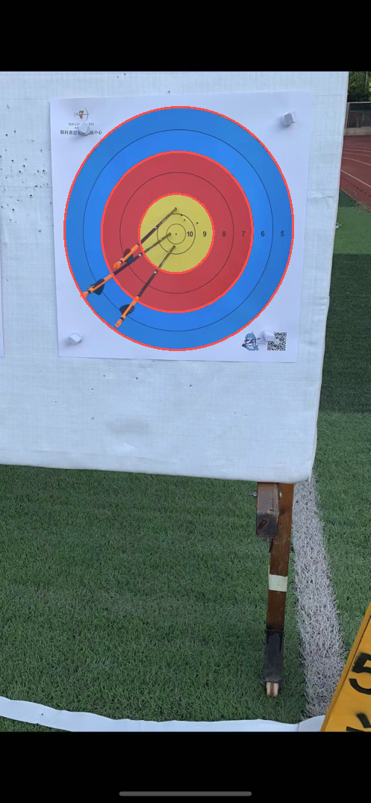
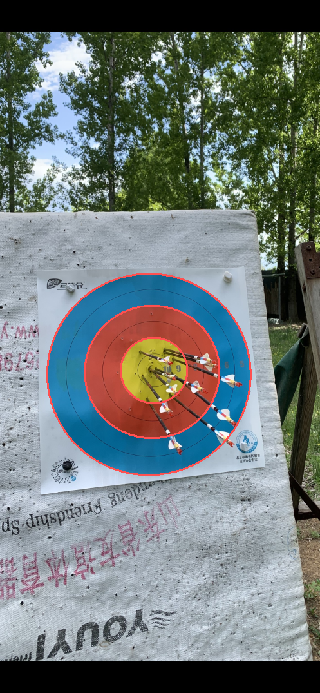

# 🏹Target Detector🎯

本项目是一个箭靶检测，旨在实现高效、准确的识别箭靶，靶纸梯形校正等功能。

该模块实现了基于HSV颜色空间阈值的射箭靶色环轮廓识别功能。通过对输入图像进行颜色过滤、形态学操作、连通域分析等处理，最终实现对不同颜色靶环的外轮廓进行凸包计算与椭圆拟合, 实现较高准确率和鲁棒性。

后续将实现对射箭靶纸角落进行识别，并对靶纸做梯形矫正。(under_dev)

## 识别效果

<p align="center">
     </img>
     </img>
</p>

## 目录结构

```
src/
├── circle_detector.py # 色环识别
└── corner_detector.py # 靶纸角落识别(under_dev)
```


